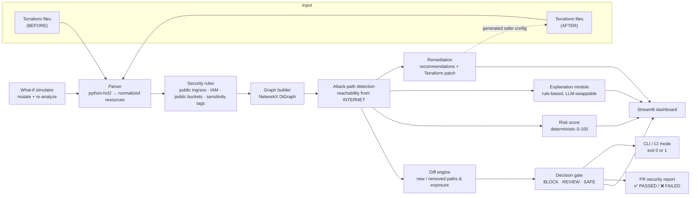

# BlastRadius

**Attack-path diff for Terraform pull requests.**

Your Terraform diff shows what changed. **BlastRadius shows what became reachable.**

Install the GitHub check, open a Terraform PR, and receive one updated security
comment explaining the modeled attack-path change and merge decision.

```text
Terraform PR → Attack graph diff → New path to sensitive data → 🚫 BLOCK CHANGE
Fix Terraform → Re-analyze → No new modeled critical paths → ✅ SAFE TO MERGE
```

**Know the blast radius before you merge.** BlastRadius is a simplified static
security model—not proof that infrastructure is safe. It requires no AWS account,
credentials, deployment, or paid service.

**Availability:** installable packaging and the PR workflow are published on GitHub.
Installation from commit `a72c04890640102b315506ab85e5f1ccbe91bb9f` is verified.
The hosted BLOCK → SAFE flow and single-comment update are verified on PR #1.
No PyPI package or `v1` tag is published.
The copyable workflow defaults to that immutable, packaging-enabled commit.

[Add the GitHub check](#github-actions) · [Install locally](#installation) ·
[Coverage and limitations](#limitations)

A routine-looking CIDR change can produce:

```
🚫 BLOCK CHANGE
This change opens a new path from the public internet to data marked sensitive.

New critical attack paths .............. +1
Newly reachable sensitive resources .... +1   aws_s3_bucket.customer_data
Newly internet-reachable resources ..... +3   aws_instance.web_server, aws_iam_role.app, ...
Security score ......................... 100 → 20  (-80)

New attack path:
  Internet → Web SG → Web Server → App Role → Customer Data → Sensitive Data
```

Analysis runs locally against Terraform source, Git snapshots, or plan JSON.
Bundled scenarios are controlled examples, not the only supported inputs.
**No AWS credentials are read, no infrastructure is provisioned, and nothing is attacked.**

---

## The problem

A security group CIDR widened from `10.0.0.0/24` to `0.0.0.0/0` looks like a
one-line, low-risk diff in code review. Traditional static scanners flag it as a
generic "SSH open to the world" finding — the same severity whether the instance
is an empty sandbox or one holding credentials to a bucket full of customer PII.

What reviewers actually need to know is **what that line connects**. Risk lives in
the *composition* of resources: a public port only matters because of the IAM role
behind it, and that role only matters because of the data it can read.
BlastRadius makes that composition explicit, shows how it changed, and turns it
into a merge decision.

---

## Architecture



### Pipeline

| Stage | Module | Responsibility |
|---|---|---|
| Parse | `blastradius/parser/terraform_parser.py` | Load HCL, strip quotes/heredocs/interpolations, resolve `aws_x.y` references |
| Model | `blastradius/parser/models.py` | `TerraformResource`, `ResourceNode`, `GraphEdge`, `AttackPath` |
| Rules | `blastradius/security/rules.py` | Decide which edges exist (public ingress, instance profile → role, IAM → S3, public buckets, sensitivity tags) |
| Graph | `blastradius/graph/graph_builder.py` | Build the NetworkX attack graph |
| Analyze | `blastradius/graph/attack_paths.py` | Reachability from `INTERNET`, path enumeration, risk level |
| Diff | `blastradius/graph/diff_engine.py` | New/removed nodes, edges, exposure and attack paths; verdict |
| Decide | `blastradius/security/decision.py` | BLOCK / REVIEW / SAFE gate with explainable reasons |
| Score | `blastradius/security/risk_score.py` | Deterministic 0-100 score |
| Explain | `blastradius/security/explain.py` | Prose explanation behind a swappable provider interface |
| Remediate | `blastradius/security/remediation.py`, `security/hcl_edit.py` | Recommendations + local Terraform patch |
| Simulate | `blastradius/simulation.py` | What-if mutations analysed by the real engine |
| Report | `blastradius/report.py` | GitHub-style PR check comment |
| CI | `blastradius/cli.py` | Command line entry point with exit codes |
| Render | `blastradius/visualization/graph_renderer.py` | PyVis graph with a pinned, deterministic layout |
| UI | `app.py` | Streamlit dashboard |

---

## Supported Terraform resources

The MVP deliberately supports a small set of resources. Anything else is ignored
rather than guessed at, so the graph never contains relationships the tool cannot
justify.

| Resource | Used for |
|---|---|
| `aws_security_group` | Internet exposure (`ingress` rules) |
| `aws_instance` | Compute nodes, security-group and instance-profile attachment |
| `aws_iam_role` | Privilege nodes |
| `aws_iam_instance_profile` | Links EC2 → IAM role |
| `aws_iam_role_policy`, `aws_iam_policy`, `aws_iam_role_policy_attachment` | IAM → S3 permissions |
| `aws_s3_bucket` | Data nodes and sensitivity tags |
| `aws_s3_bucket_acl`, `aws_s3_bucket_policy` | Direct public exposure of a bucket |

IAM and bucket policies must be written as heredoc JSON (see
`examples/safe/main.tf`) so they can be parsed deterministically;
`jsonencode(...)` expressions are skipped rather than misinterpreted.

---

## Attack-path logic

The graph has six node types:

```
INTERNET ──ingress allows──► SECURITY_GROUP ──protects──► EC2
   ──assumes role──► IAM_ROLE ──can access──► S3_BUCKET ──contains──► SENSITIVE_DATA
INTERNET ──public access──────────────────────────────────► S3_BUCKET
```

| Edge | Created when |
|---|---|
| `INTERNET → SECURITY_GROUP` | An `ingress` rule allows `0.0.0.0/0` or `::/0`. Severity is **CRITICAL** if the rule reaches an administrative port (22 SSH, 3389 RDP) or covers all protocols, **HIGH** for a wide port range, otherwise **MEDIUM**. `egress` is ignored. |
| `SECURITY_GROUP → EC2` | The instance references the group in `vpc_security_group_ids` or `security_groups`. |
| `EC2 → IAM_ROLE` | `iam_instance_profile` resolves through `aws_iam_instance_profile.role` to a role — i.e. credentials are readable from instance metadata. |
| `IAM_ROLE → S3_BUCKET` | A policy attached to the role has an `Allow` statement with an `s3:*`/`s3:...`/`*` action. Explicit bucket ARNs create targeted edges; `"Resource": "*"` creates edges to every bucket and raises severity. |
| `INTERNET → S3_BUCKET` | The bucket has a public canned ACL (`public-read`, inline or via `aws_s3_bucket_acl`) or a bucket policy allowing an S3 action to Principal `"*"`. |
| `S3_BUCKET → SENSITIVE_DATA` | The bucket is tagged `Sensitive = "true"` or has a `DataClass`/`DataClassification` of `pii`, `phi`, `secret`, `confidential` or `restricted`. |

A resource is **externally exposed** when a directed path exists from `INTERNET`
to it. A **critical attack path** is any path from `INTERNET` to a
`SENSITIVE_DATA` node, enumerated with `networkx.all_simple_paths`.

Every edge records the Terraform resource that created it and the exact
configuration that proves it, so the UI can justify each hop:

```
Network exposure: Internet → Web Server
  Reason: Security group allows 0.0.0.0/0 on port 22 (SSH)
  relationship: ingress allows · resource: aws_security_group.web
  ingress { protocol = "tcp", from_port = 22, to_port = 22, cidr_blocks = ["0.0.0.0/0"] }
```

### Merge decision

Deterministic and ordered:

| Decision | Condition |
|---|---|
| 🚫 **BLOCK CHANGE** | A new critical path appeared, or a sensitive resource became internet-reachable |
| ⚠ **REVIEW REQUIRED** | No new critical path, but new internet-reachable resources, new non-critical paths, or a lower score |
| ✅ **SAFE TO MERGE** | No new exposure (possibly removed some) |

Only **BLOCK** fails CI. The decision always ships with the four counts that
produced it.

### Security score

A transparent heuristic starting at 100 — useful for comparison, **not** a
validated risk metric:

| Finding | Penalty | Cap |
|---|---|---|
| Administrative port open to `0.0.0.0/0` | −20 | −40 |
| S3 bucket readable directly from the internet | −20 | −40 |
| Compute instance reachable from the internet | −15 | −30 |
| Broad IAM data permission (`s3:*` or `Resource: *`) | −10 | −20 |
| Sensitive resource reachable from the internet | −25 | −25 |
| Complete internet → sensitive-data path | −20 | −20 |

Clamped to `[0, 100]`. Identical input always produces an identical score, which
is what makes the before/after comparison trustworthy.

---

## Installation

Requires **Python 3.11+** and Git (verified locally on Windows / Python 3.14).
The CLI has three direct dependencies: NetworkX, python-hcl2, and PyYAML. The
Streamlit dashboard is optional. Packaging uses `pyproject.toml`; the wheel was
built and installed in a fresh virtual environment and tested with isolated Python
imports. Nothing was uploaded to PyPI or released.

From this local checkout, available now:

```bash
python -m venv .venv
# Windows
.venv\Scripts\activate
# macOS / Linux
source .venv/bin/activate

python -m pip install .
blastradius --help
```

For dashboard development and tests, use `python -m pip install ".[ui,dev]"` and
run `streamlit run app.py` from the source checkout. The CLI wheel intentionally
does not bundle the dashboard entry file, demo Terraform, or test suite.

Install the published, pinned implementation without vendoring source:

```bash
python -m pip install "git+https://github.com/Mighiana/BlastRadius.git@a72c04890640102b315506ab85e5f1ccbe91bb9f"
blastradius --repo /path/to/terraform-repo --base main --head feature/network-change
```

This commit exists and installation from it has been tested. It is a source
revision, not a versioned release. Do **not** use plain
`pip install blastradius` or `uses: Mighiana/BlastRadius@v1`: no such distribution
or Action release is asserted by this project.

## Running

### Dashboard

```bash
streamlit run app.py
```

Open http://localhost:8501. The app loads the blocking comparison immediately; no
configuration is required. The product is organized into **Overview**, **Attack Path**,
**Infrastructure Diff**, **PR Security Report**, and **Remediation** tabs. The sidebar
keeps the three scenarios visible; filesystem inputs live under **Advanced** expanders.
Enable **Demo Mode** to hide advanced inputs and tabs and show the decision, graph,
explanation, and fix together. After a successful fix, the hero explicitly shows
**BLOCK CHANGE → SAFE TO MERGE** based on re-analysis.

### CI mode

```bash
python -m blastradius.cli --before examples/safe --after examples/vulnerable
```

```
Decision : BLOCK CHANGE
Verdict  : SECURITY REGRESSION
Score    : 100 -> 20 (-80)
Risk     : LOW -> CRITICAL
```

| Flag | Effect |
|---|---|
| `--format summary` | Human-readable summary (default) |
| `--format pr` | The PR comment BlastRadius would post |
| `--format json` | One valid JSON document, including coverage diagnostics |
| `--format sarif` | SARIF 2.1.0 findings, resource/file evidence and remediation |
| `--policy PATH` | Explicit trusted policy file (overrides discovery) |
| `--fail-on-review` | Also fail on REVIEW REQUIRED, not just BLOCK |
| `--github-action` | Read PR SHAs from the validated `pull_request` event |
| `--report-dir PATH` | Generate marked Markdown, JSON, SARIF and summary together |
| `--github-output PATH` | Append safe scalar outputs for later workflow steps |
| `--github-summary PATH` | Append the result and report to the Actions summary |
| `--comment-file PATH` | Write a concise marked PR comment without publishing it |

Exit codes: **0** = gate passes (SAFE or REVIEW by default), **1** = gate blocks
(including configured policy violations), **2** = usage/input/policy error.
`--fail-on-review` also fails REVIEW. Both exit 1 and exit 2 must fail CI; an input
error is never a successful security check. That is all a CI job needs:

```yaml
- run: python -m blastradius.cli --before $BASE_TF --after $HEAD_TF --format pr
```

### Analyze local Git changes

```bash
python -m blastradius.cli --repo /path/to/repo --base main --head feature/network-change --terraform-dir infra
python -m blastradius.cli --repo /path/to/repo --base main --head feature/network-change --terraform-dir infra --format json
```

The dashboard offers the same input under **Advanced: Analyze Git change**.
Refs are resolved to commit SHAs; only Git read operations are used. No checkout,
stash, reset, or working-tree writes occur. CLI snapshots use a temporary directory
that is cleaned on exit. Dashboard snapshots live for the session. Uncommitted
changes are not analyzed. Terraform is nonrecursive: choose one root directory.
If several directories contain Terraform, `--terraform-dir` is required.

Added and removed files are included in the comparison. If either side has **no**
Terraform files, analysis stops with exit 2 and an actionable message rather than
calling a missing baseline safe. A first-ever Terraform addition or complete
removal therefore needs manual review in this MVP. Missing refs and non-Git
paths also return exit 2. Tests use real temporary Git repositories and verify
that dirty working trees are preserved.

### Analyze Terraform plan JSON

```bash
python -m blastradius.cli --plan examples/plans/ssh_open_plan.json
python -m blastradius.cli --plan examples/plans/ssh_open_plan.json --format json
python -m blastradius.cli --plan examples/plans/ssh_open_plan.json --format sarif
```

For an existing real plan, produce the input with `terraform show -json plan.out`.
BlastRadius does **not** run Terraform or contact AWS. The bundled plan fixture is
handwritten and works without either installed.

`parser/inputs.py` normalizes HCL directories/files or plan JSON into `ParsedConfig`.
A single plan supplies prior state and planned values; `resource_changes` is a
fallback. Resolved IDs, names and bucket ARNs are relinked to resource addresses.
Candidate configuration references are used only on the **after** side, never to
rewrite prior-state relationships. Unknown values are not fabricated. Resources
outside supported types and real module/indexed addresses are reported as outside
coverage rather than merged into similarly named root resources.

Plan mode is CLI-only for now. Its graph, scores and decision match the bundled
HCL scenario in automated tests. Complex module/count/for_each expansion, unknown
policy evaluation and full Terraform expression evaluation remain unsupported.
Plan JSON can contain sensitive values: keep it local and do not commit real plans
or publish them as CI artifacts. Reports contain findings, not the whole plan.

### Repository policy

Optional `blastradius.yml`:

```yaml
version: 1
terraform_dir: infra
gate:
  block_new_critical_paths: true
  block_new_sensitive_exposure: true
  block_public_admin_ports: true
allowed:
  public_https: true
thresholds:
  minimum_security_score: 70
```

`terraform_dir` is optional and repository-relative. Git/Actions mode reads it
from the **base commit**, not an unreviewed candidate change. Precedence is an
explicit `--terraform-dir` / workflow variable, then trusted configuration, then
single-root discovery. Multiple roots without a selection are an error, never a
silent choice. Add root configuration to the base branch before relying on it in
PRs. Candidate policy changes need separate review.

No file preserves the existing secure, context-aware gate: new critical paths and
sensitive exposure block; noncritical exposure (including public SSH) requires
review. An explicit policy enables standalone public-admin blocking by default.
`public_https: true` means HTTPS alone is not a blocker, **not** that a path through
HTTPS to sensitive data is exempt. The score threshold checks the candidate's
absolute score, including unchanged infrastructure. Policy never alters graph
edges, findings, or scores. Disabling critical gates is explicit and leaves
findings visible with at least REVIEW; invalid policy files cause exit 2.

Directory mode discovers policy in BEFORE, then the current working directory.
Plan mode searches the plan's parent, then the current directory. Git mode uses
**only the base commit's repository-root policy**, unless `--policy` explicitly
selects a trusted local file. Candidate policy edits cannot weaken their own gate.
Protect policy changes with review and branch protection outside this tool.

### GitHub Actions

**New-repository setup** (no vendoring of Python source is required):

1. Copy `examples/github-action/blastradius-pr-check.yml` into your Terraform
   repository as `.github/workflows/blastradius.yml`.
2. Keep the built-in immutable analyzer pin, or optionally set repository variable
   `BLASTRADIUS_REVISION` to another reviewed, packaging-enabled 40-character SHA.
   No variable is required for the supplied default. Invalid or uninstallable
   overrides fail clearly; moving branch names are not accepted.
3. With one Terraform root, no root setting is needed. For multiple roots, set
   optional repository variable `BLASTRADIUS_TERRAFORM_DIR=infra`, or add
   `terraform_dir: infra` to the base branch's `blastradius.yml`.
4. Open or update a Terraform PR. Base/head inputs come from GitHub automatically;
   users do not provide BEFORE/AFTER directories or branch names.
5. Inspect **BlastRadius** in the PR's checks, the Actions job summary, the report
   artifact, and (where permissions permit) the single updated PR comment.
6. Configure the check as required in GitHub branch protection yourself. Running
   a workflow does not by itself prevent merges.

The workflow runs on `pull_request` opened/synchronize/reopened/ready-for-review.
It intentionally has no Terraform-only path filter, so a required check does not
stay pending when other files change. It analyzes one Terraform root per run.

**Trust boundaries:** it checks out the consumer repository's trusted **base SHA**,
fetches PR head objects without checking out the candidate, installs BlastRadius
from the reviewed upstream SHA into an isolated venv, and runs Python with `-I`
from the runner temp directory. Candidate Python, workflows, shell scripts,
Terraform providers, and module downloads are never executed. Untrusted branch
names are never interpolated into shell commands. The analysis runs without an
exported GitHub write token; only fetch and comment steps receive scoped tokens.

**Permissions:** `contents: read` is required for private-repository fetches;
`pull-requests: write` permits comments. The standard Actions `GITHUB_TOKEN` is
sufficient—no personal access token, AWS secret, or paid service is needed.
Fork/Dependabot policies may downgrade it to read-only or require maintainer
approval. Do not bypass those controls with `pull_request_target`. With no write
permission, analysis still runs, artifacts and the job summary remain available,
and comment publication fails nonfatally with a clear message.

**One comment:** publication uses `<!-- blastradius-report -->` and verifies the
`github-actions[bot]` author before updating. It searches paginated comments,
skips an unchanged body, and rejects stale PR-head results. A per-PR concurrency
group serializes/cancels overlapping runs to avoid duplicate or outdated comments.
It does not modify a contributor's look-alike comment or delete any comments.
The built-in publisher targets GitHub.com with the Actions bot token, not arbitrary
PAT authors or GitHub Enterprise API endpoints.

**Outputs and exit behavior:** one analysis produces all report formats and these
step/job outputs:

| Output | Meaning |
|---|---|
| `decision` | `BLOCK CHANGE`, `REVIEW REQUIRED`, `SAFE TO MERGE`, or `ERROR` |
| `security_score_before` | Baseline heuristic score |
| `security_score_after` | Candidate heuristic score |
| `critical_paths_added` | Count of new modeled critical paths |
| `sensitive_resources_added` | Count of newly reachable sensitive resources |
| `exit_code` | 0 passes, 1 blocks, 2 means incomplete/invalid analysis |

Use `steps.analysis.outputs.decision` in later steps, or the corresponding
`needs['blast-radius'].outputs` values in dependent jobs. Error counts are blank
(unknown), never zero masquerading as a successful scan. The final gate preserves
exit 0/1/2 regardless of comment permissions. `--fail-on-review` can enforce review
findings as well. Setup failures never result in a successful check.

Artifacts: `report.md` (marked comment), `summary.md`, `result.json`, and
`results.sarif`. The summary begins **BlastRadius — BLOCKED / PASSED / REVIEW
REQUIRED / ERROR** with the critical-path count. A passing report says **No new
modeled critical attack paths detected**, not that AWS infrastructure is safe.
SARIF is uploaded as an artifact, not automatically submitted to code scanning.

For trusted local automation, the publisher can also be invoked explicitly:

```bash
blastradius --repo /path/to/repo --base main --head feature/change --report-dir reports
blastradius-comment --repository owner/repo --pr 123 --head-sha FULL_HEAD_SHA --report-file reports/report.md
```

Publication reads `GITHUB_TOKEN` from the environment and never accepts or prints
it as a command-line argument. This second command makes a real GitHub API write;
it is **not** executed by local tests. Use only with an authorized Actions bot token.

`.github/workflows/blastradius.yml` is this project's own CI/test workflow; its
internal gate uses bundled `examples/safe`. The external-install workflow is the
example above. YAML, shell syntax, gate exits, installation, and event inputs are
locally tested. Hosted PR analysis and comment updates are verified on the public,
same-repository [acceptance PR #1](https://github.com/Mighiana/BlastRadius/pull/1).
The repository's Linux test suite and CLI gate also passed in
[GitHub CI run 35441042287](https://github.com/Mighiana/BlastRadius/actions/runs/35441042287).

| Hosted acceptance (2026-09-19) | Risky head | Remediated head |
|---|---|---|
| Gate decision | BLOCK CHANGE | SAFE TO MERGE |
| Candidate security score | 20 | 100 |
| New critical paths | 1 | 0 |
| Newly reachable sensitive resources | 1 | 0 |
| Workflow conclusion | Failure at enforcement, as intended | Success |
| Run | [35441550348](https://github.com/Mighiana/BlastRadius/actions/runs/35441550348) | [35441968970](https://github.com/Mighiana/BlastRadius/actions/runs/35441968970) |

Both runs successfully installed the published analyzer, analyzed the real Git
snapshots, uploaded report artifacts, and published the bot report. The initial
run failed only at the gate. The second run passed the gate and updated the
**same comment**, ID `5741664556`, from BLOCK to SAFE; exactly one marked bot comment
was present. [View the updated comment](https://github.com/Mighiana/BlastRadius/pull/1#issuecomment-5741664556).
The fixed report shows 100 → 100 because PR analysis compares against the original
safe base, not the preceding risky head. PR #1 is intentionally left open and unmerged.

This hosted verification covers a public, same-repository PR using the Actions bot.
Fork/read-only-token behavior remains locally tested through mocked permission
failures; it has not been exercised on a hosted fork/private repository.

For this repository's live acceptance test, `.github/workflows/blastradius-hosted-test.yml`
uses the same published analyzer and bot-comment path against `examples/hosted-pr`.
This isolated fixture is never deployed and does not change the existing demo
configurations. The test PR is intended to remain unmerged.

### SARIF findings

```bash
python -m blastradius.cli --before examples/safe --after examples/vulnerable --format sarif > blastradius.sarif
```

A regression still exits 1 while emitting its valid SARIF document. Rules are
`BR001` (critical path), `BR002` (noncritical exposure path), and `BR003` (blocking
gate). Each result includes severity, message, resource when known, attack path,
and recommendation. Source filenames are included without invented line numbers;
Git results use repository-relative paths. Plan results reference the plan JSON,
not a guessed Terraform source file. Clean and regression output have been
validated against the published SARIF 2.1.0 schema.

### Tests

```bash
python -m pytest
```

Point the **BEFORE** / **AFTER** directory inputs in the sidebar at any two local
directories containing `.tf` files (for example two git worktrees) to use it on
your own Terraform.

---

## Demo workflow

The dashboard opens directly on the money shot — no menus to navigate.

1. **Baseline.** `examples/safe/` — EC2 behind a security group that only allows
   SSH from `10.0.0.0/24`, an IAM role that can read one bucket, and that bucket
   tagged sensitive. `INTERNET` is disconnected from everything:
   **risk LOW, 0 critical paths, score 100**.
2. **The change.** `examples/vulnerable/` differs by **exactly one line** (line 28)
   — `cidr_blocks = ["10.0.0.0/24"]` becomes `cidr_blocks = ["0.0.0.0/0"]`. A test
   enforces the one-line claim so it cannot rot.
3. **The decision.** 🚫 **BLOCK CHANGE**, score `100 → 20`, and the new path is
   drawn thick and red while unchanged infrastructure fades back:
   `Internet → Web SG → Web Server → App Role → Customer Data → Sensitive Data`.
4. **The explanation.** Each hop states the relationship, the responsible
   Terraform resource and the configuration that proves it, followed by a
   plain-English attacker narrative.
5. **The PR check.** A ready-to-post ❌ FAILED report with the responsible
   Terraform change (`10.0.0.0/24 → 0.0.0.0/0`) and a recommendation, copyable in
   one click.
6. **The fix.** *Generate Safer Configuration & Re-analyze* writes a patched copy
   to `examples/generated_fix/` and re-runs the analysis.
7. **The proof.** ✅ **SAFE TO MERGE**, the path is listed as eliminated, the PR
   report flips to ✅ PASSED, and the score returns to 100.

**Interactive alternative:** *Restore safe configuration* → *Simulate risky
change* mutates the baseline live, writes it to a scratch directory, and runs it
through the same parser and graph engine. Nothing is faked — a test asserts the
simulated result is identical to the committed vulnerable config.

### Demo scenarios

Three bundled scenarios prove the engine reasons about reachability rather than
pattern-matching one prepared file. Each has a **clean baseline** and a change
that BlastRadius blocks — for a different root cause:

| Scenario | Root cause | The change | Resulting path |
|---|---|---|---|
| Public SSH exposure | network | SSH ingress `10.0.0.0/24` → `0.0.0.0/0` | Internet → Web SG → Web Server → App Role → Customer Data |
| Overly broad IAM permission | identity | `s3:PutObject` on one bucket → `s3:*` on `"*"` | Same entry point (a deliberately public 443 listener), but the role now reaches the sensitive bucket |
| Public sensitive S3 bucket | storage | Bucket ACL `private` → `public-read` | Internet → Customer Data → Sensitive Data (no compute involved) |

The IAM scenario also demonstrates that remediation is surgical: BlastRadius
recommends narrowing the IAM policy and **refuses to auto-patch** the
intentionally public 443 listener, because "fixing" it would cause an outage.

### Screenshots

No current screenshot files are bundled. Run the dashboard to see the actual
UI; this README does not substitute mock images for verified screenshots.

---

## Limitations

BlastRadius uses a **simplified, intentionally incomplete** model of AWS
reachability. It is a defensive cloud-security research and educational tool that
operates on controlled Terraform configurations.

* **Not the real AWS security model.** VPC routing, subnets, route tables, NACLs,
  internet/NAT gateways, load balancers, SCPs, permission boundaries, public
  access blocks and KMS grants are **not** modelled.
* **A detected path is not proof of exploitability**, and the absence of a path is
  **not proof of safety**.
* **Static only.** HCL source and plan JSON are supported locally. No live-state
  import, module/indexed resource expansion, unknown-value evaluation, variables
  or remote data-source execution. A pass means no new modeled blocking findings,
  not full coverage or proof of AWS safety.
* **Sensitivity is declared, not discovered** — it comes from Terraform tags.
* **IAM parsing is shallow.** Heredoc JSON policies only; no wildcard ARN
  matching, conditions or `NotAction`/`NotResource` semantics.
* **Score and decision are heuristics**, not calibrated risk measures.
* Nothing is ever deployed, and no AWS credentials are used.

---

## Implemented versus simulated

**Implemented and locally tested:** HCL/plan normalization, NetworkX traversal,
base/head Git extraction, graph comparison, policy decisions, CLI exit codes,
JSON/SARIF/Markdown reports, and Streamlit interactions. Also verified: wheel
installation into a clean environment, real local Git risky/fixed commits, Actions
input/output handling, shell exit behavior, and mocked create/update/permission
failure GitHub API cases. The attack-path engine, AWS coverage, scenarios,
remediation and score formula are preserved.

**Controlled demonstrations:** the three Terraform scenarios and plan fixture are
synthetic inputs. Simulation edits real Terraform text and reuses the same engine;
it does not fake reachability. Fixes are local recommendations, not AWS changes.

**Hosted-GitHub verified:** PR #1 demonstrated an actual blocking gate, report
artifact upload, bot-comment creation, remediation, a passing gate, and an update
to the same comment. The run links and observed counts are recorded above. The
analyzer was installed from its immutable published GitHub commit on Ubuntu.

**Locally tested, not hosted-verified:** fork/read-only permission fallback, invalid
API responses, and stale-head handling have mocked API tests. Broader private/fork
repository acceptance remains future work. Packaging is published as installable
GitHub source, not as a PyPI package, `v1` Action, or release.

**Not production assurance:** AWS reachability and IAM are simplified; incomplete
coverage can miss paths. No branch protection, cloud deployment, hosted service,
or automatic PR remediation is configured by running the local tool.

## Future roadmap

Not implemented:

* VPC / subnet / route-table and NACL awareness
* More resources: RDS, Lambda, Secrets Manager, EKS/Kubernetes
* Azure and GCP providers
* Live AWS account import (read-only) for drift-aware graphs
* Checkov and Trivy integration to enrich nodes with existing findings
* Broader hosted acceptance coverage for forks/private repositories and a reviewed
  versioned distribution release
* GitHub Enterprise API support and multi-root aggregation into one report
* AI-agent remediation that opens the fix PR directly
* MITRE ATT&CK technique mapping per edge
* Broader plan support: module/count/for_each addresses, unknown-value tracking,
  standalone state import and explicit deny/condition evaluation
