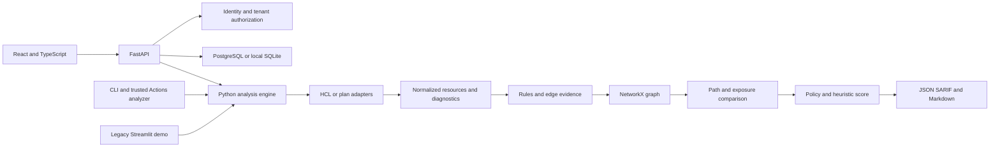

# Architecture

## Decision

Keep the Python engine and CLI. Move the multi-user product interface to
React/TypeScript with Vite and expose the engine through FastAPI. Streamlit
remains a separate controlled legacy demo.

React makes responsive navigation, accessible components and explicit
loading/error states practical. FastAPI separates authenticated requests,
tenant-scoped storage and bounded analysis jobs from rendering. This is not a
reason to replace tested parsing or graph algorithms.

## Source boundaries

Paths in this table are relative to `blastradius/` unless marked otherwise.

| Boundary | Existing module or target |
|---|---|
| Local/Git/plan inputs | `gitsource.py`, `parser/inputs.py`, `parser/plan_parser.py` |
| HCL and normalized model | `parser/terraform_parser.py`, `parser/models.py` |
| Rules and graph | `security/rules.py`, `graph/graph_builder.py` |
| Paths, comparison, policy | `graph/attack_paths.py`, `graph/diff_engine.py`, `security/decision.py`, `policy.py` |
| Scores and explanations | `security/risk_score.py`, `security/explain.py` |
| Local patch suggestions | `security/remediation.py`, `security/hcl_edit.py` |
| Reports and CLI | `report.py`, `sarif.py`, `cli.py` |
| Service target | `server/`, entry point `blastradius.server.app:app` |
| Browser target | Repository-root `web/`, production assets `web/dist/` |
| Legacy UI | Repository-root `app.py`, `visualization/graph_renderer.py` |

The service/browser rows are integration targets, not verified capabilities
of the release-only branch.

## Request and data flow

An authenticated principal selects a tenant-scoped project and submits bounded
input data, not a host path. The service validates requests, authorizes tenant
membership, assigns job identifiers and runs the engine with isolated scratch
storage. Stored results use the same tenant/project scope.
Every later read, download and delete must repeat authorization.
The service owner determines whether jobs are synchronous or backgrounded;
do not claim a durable queue unless it survives restart testing.

The engine must never acquire service credentials, query billing, or choose an
organization. API/browser code must not reimplement policy decisions.
Schema versions and coverage diagnostics travel with reports so a changed
model is not mistaken for an infrastructure change.

## Storage and process boundaries

PostgreSQL is the deployment target. SQLite supports local evaluation; it does
not verify multi-replica concurrency or PostgreSQL migrations.
Unique job directories are temporary work space, not durable tenant history.
Only application data volumes are writable in Compose.

Node builds browser assets; the final Python runtime does not need Node.
Static serving and SPA fallback belong to the service unit: confirm
`/app/web/dist` is served and API routes cannot fall through to HTML.
See [integration contract](release-integration.md).

## Release boundaries

The CLI consumer installs historical revision
`a72c04890640102b315506ab85e5f1ccbe91bb9f`; it does not adopt this branch
automatically. The legacy public demo is also a separate deployment.
Record the engine revision, UI build, migration head and image digest used
together in any new release.
