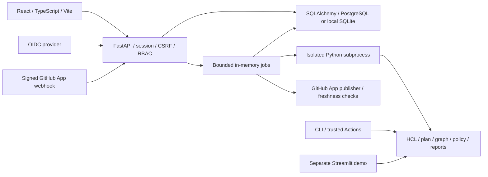

# Architecture

## Failure and ownership boundaries

Worker envelopes and report decision/completeness fields are validated before
either manual or GitHub analysis persistence. Invalid results fail without
normalized findings, paths or artifacts. Committed analysis submissions count
against usage even if executor dispatch fails; such submissions become terminal
`dispatch_failed` records, and their admission reservation is released.

Terminal persistence is attempted three times with bounded delays. A failed result
transaction falls back to a failed analysis. Exhaustion emits
`analysis.persistence_failed`, makes readiness fail and closes job admission.
Operators must restore database availability and restart the sole server to run
startup recovery if all attempts are exhausted; this queue is not durable.

The PostgreSQL lease is checked at readiness, admission and during isolated
worker execution. Loss is irreversible for that process: workers are killed and
reaped, database writes are rejected, and GitHub processing stops. Write
transactions hold a shared advisory fence; a successor takes the exclusive fence
before startup recovery so obsolete transactions cannot commit after recovery.
Run exactly one ASGI process per database. A replacement may start only after it
acquires the lease; do not add replicas or multiple Uvicorn workers.

## Components and flows

Login provisions a user identified by OIDC issuer/subject and a Free workspace.
Requests use a hashed-at-rest opaque server session and a separate CSRF token.
Workspace membership is checked for each project, job, evidence and export route.
No client-supplied tenant ID or plan name is treated as authority.

Owners/admins configure projects and entitled policies. Developers also submit
analyses; viewers read retained evidence. Submission locks the organization,
checks active-project state, reserves monthly quota, snapshots the effective
trusted policy and persists a queued analysis. A full queue or rejected request
does not consume quota. Accepted failures and deleted jobs still count.

The job manager runs the installed worker with `python -I`, bounded scratch,
time/memory/file/CPU budgets and a minimal environment without service secrets.
Input files are data; no candidate scripts, providers, modules or workflows run.
Completed reports are persisted with sanitized source references, normalized
findings, ordered path hops and artifacts. Raw uploads are temporary; reports
still reveal architecture. See [data lifecycle](data-lifecycle.md).

GitHub jobs use verified installation/repository IDs and the same tenant quota
and policy model. Current PR base/head identities and refs are checked before
analysis and publishing mutations. Publication touches only this App's checks
and marked comments. Delivery hashes, run IDs and uncertain-write markers
prevent blind duplicate publication. See [GitHub contracts](github.md).

## Storage schema

Alembic head is **0003**; readiness compares the database version to the packaged
current head, rather than assuming the initial migration. Upgrades from populated
0001 preserve reports and users and convert legacy `member` to `developer`.

| Tables | Responsibility |
| --- | --- |
| `users`, `sessions` | Provider identity, verified email and revocable sessions |
| `organizations`, `memberships`, `invitations` | Workspace, role, hashed one-time email-bound invitation |
| `projects` | Metadata, explicit root, archive state and trusted project policy |
| `analyses` | Status, provenance, immutable policy snapshot, summaries and result JSON |
| `findings`, `attack_paths`, `attack_path_hops`, `analysis_artifacts` | Normalized evidence and exports |
| `usage`, `audit_events` | UTC monthly reservations/export counters and audit events |
| `github_installations`, `repository_connections` | Operator-verified tenant/provider identity mapping |
| `github_deliveries`, `github_runs` | Idempotency, PR boundaries, publication reconciliation |
| `billing_events` and legacy organization billing columns | Inert upgrade-preservation fields; no runtime payment authority |

The models and migrations define foreign keys and cascades. Deleting analysis
evidence preserves GitHub run tombstones by nulling the analysis link. Usage
does not reset when evidence is deleted. Retention gates all evidence reads;
physical cleanup is a bounded operator command, not an installed scheduler.

## Source boundaries

| Boundary | Modules |
| --- | --- |
| Inputs | `gitsource.py`, `parser/terraform_parser.py`, `parser/plan_parser.py` |
| Relationships / paths | `security/rules.py`, `graph/graph_builder.py`, `graph/attack_paths.py` |
| Comparison / decision | `graph/diff_engine.py`, `policy.py`, `security/decision.py` |
| Reports / CLI | `report.py`, `sarif.py`, `cli.py` |
| Authentication / authorization | `server/auth.py`, `server/lifecycle.py` |
| Plans / quota / persistence | `server/plans.py`, `server/quotas.py`, `server/persistence.py` |
| Execution | `server/jobs.py`, `server/worker.py`, `server/analysis.py` |
| GitHub | `server/github_routes.py`, `server/github_service.py`, `server/github_publish.py` |
| Browser | `web/src/`; Zod validates API responses, Python owns decisions |

Python paths above are relative to `blastradius/`. Plans have one authoritative
catalog; UI pricing and entitlements consume it through the API.

## Deployment boundary

One Uvicorn process and an in-memory queue are supported. A PostgreSQL advisory
lock or local SQLite file lock rejects a second process; this is not horizontal
scaling or a durable broker.
Interrupted analyses fail closed on restart; GitHub deliveries need redelivery.
An isolated subprocess is not a separate kernel/security boundary.

The runtime image contains the installed wheel and built frontend, runs as
UID/GID 10001, and uses read-only root plus bounded writable storage. PostgreSQL
is the production database target; SQLite supports local use. OIDC, TLS ingress,
database TLS/PITR, backups, monitoring and retention scheduling remain operator
configuration. See [deployment](deployment.md) and [readiness](readiness.md).
